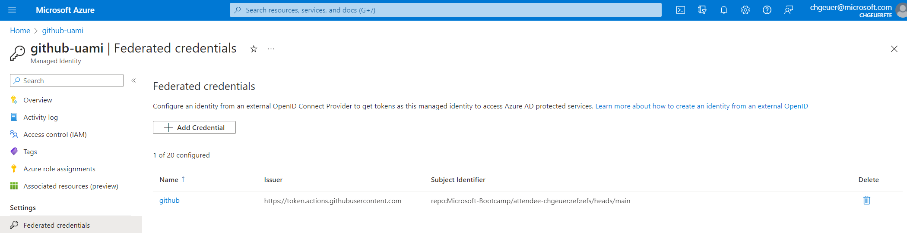
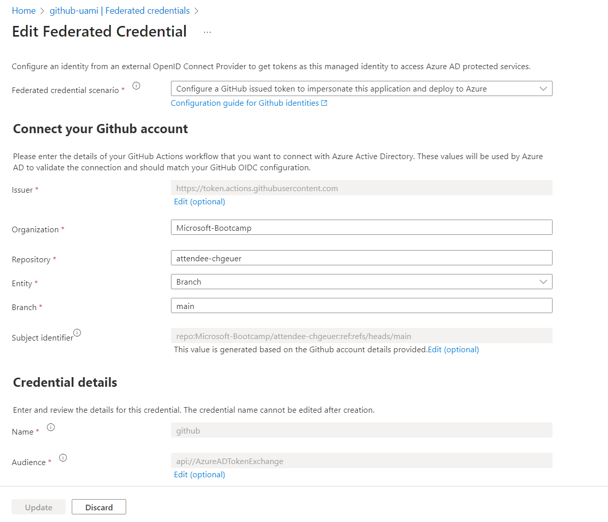
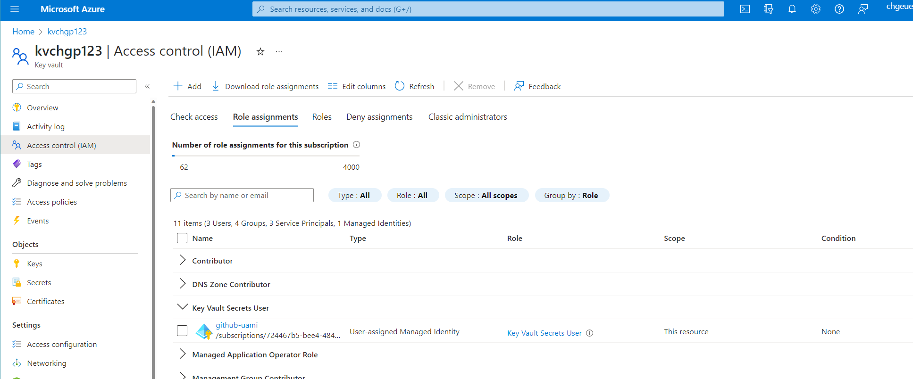
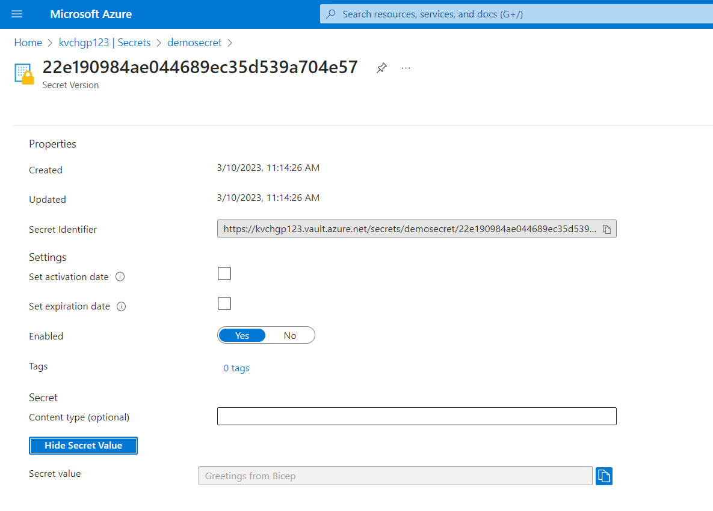
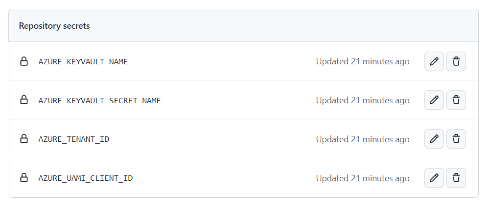

# Fetch an Azure Key Vault secret from a GitHub Action - without any secrets

> tl;dr: You can sign-in to an Azure User-assigned managed identity using a federated credential (using GitHub's IdP), and then use that UAMI to fetch a secret from Key Vault.

The following sequence diagram illustrates the flow:

```mermaid
sequenceDiagram
    participant GitHub IdP
    participant GitHub Action
    participant Azure/Login@v1
    participant Azure/GetKeyVaultSecrets@v1
    GitHub Action->>Azure/Login@v1: Please sign in to a UAMI on Azure side
    Azure/Login@v1->>GitHub IdP: Token Request, Authorization: Bearer ${ACTIONS_ID_TOKEN_REQUEST_TOKEN}"
    GitHub IdP->>Azure/Login@v1: Token (iss: GitHub, sub: repo:chgeuer/repo123:ref:refs/heads/main, aud: api://AzureADTokenExchange)
    Azure/Login@v1->>AAD: Token Request (client_id: uami, client_assertion_type=...jwt-bearer, client_assertion=github token, scope: KeyVault)
    AAD->>GitHub IdP->>Fetch the IdP signing key, to validate the token signature
    AAD->>Azure/Login@v1: Token (sub: uami, aud: KeyVault)
    Azure/Login@v1->>GitHub Action: SignedIn:
    GitHub Action->>Azure/GetKeyVaultSecrets@v1: Get Secret
    Azure/GetKeyVaultSecrets@v1->>KeyVault: GetSecret (Token)
    KeyVault->>Azure/GetKeyVaultSecrets@v1: Secret
    Azure/GetKeyVaultSecrets@v1->>GitHub Action: Secret
```

- The GitHub action uses the `Azure/login@v1` action to sign-in via workload identity federation into a user-assigned managed identity in the Azure subscription.
- The GitHub action then uses the `Azure/get-keyvault-secrets@v1` action to fetch the actual secret from the KeyVault.


## The `keyvault.bicep` file

```bicep
@description('Specifies the Azure location where the resources should be created.')
param location string = resourceGroup().location

@description('The name for the user-assigned managed identity')
param uamiName string

@description('The hostname for the Key Vault')
param keyvaultName string

@description('The name for the Key Vault secret')
param secretName string

@description('The value for the secret to be used by GitHub')
@secure()
param secretValue string 

@description('The GitHub user or organization name')
param githubOrgOrUser string

@description('The GitHub repo name')
param githubRepo string

@description('The GitHub repository\'s branch name')
param githubBranch string = 'main'

param defaultAudience string = 'api://AzureADTokenExchange'

var keyVaultRoleID = {
  'Key Vault Secrets User': '4633458b-17de-408a-b874-0445c86b69e6'
}
var github = {
  issuer: 'https://token.actions.githubusercontent.com'
  subject: 'repo:${githubOrgOrUser}/${githubRepo}:ref:refs/heads/${githubBranch}'
  audience: defaultAudience
}

resource uami 'Microsoft.ManagedIdentity/userAssignedIdentities@2023-01-31' = {
  name: uamiName
  location: location
  resource federatedCred 'federatedIdentityCredentials' = {
    name: 'github'
    properties: {
      issuer: github.issuer
      audiences: [ github.audience ]
      subject: github.subject
      description: 'The GitHub repo will sign in via a federated credential'
    }
  }
}

resource keyvault 'Microsoft.KeyVault/vaults@2021-11-01-preview' = {
  name: keyvaultName
  location: location
  properties: {
    enableRbacAuthorization: true
    tenantId: subscription().tenantId
    sku: { name: 'standard', family: 'A' }
    networkAcls: {
      defaultAction: 'Allow'
      bypass: 'AzureServices'
    }
  }
}

resource secret 'Microsoft.KeyVault/vaults/secrets@2021-11-01-preview' = {
  parent: keyvault
  name: secretName
  properties: {
    value: secretValue
  }
}

resource managedIdentityCanReadSecrets 'Microsoft.Authorization/roleAssignments@2022-04-01' = {
  name: guid(keyVaultRoleID['Key Vault Secrets User'], uami.id, keyvault.id)
  scope: keyvault
  properties: {
    roleDefinitionId: subscriptionResourceId('Microsoft.Authorization/roleDefinitions', keyVaultRoleID['Key Vault Secrets User'])
    principalId: uami.properties.principalId
    principalType: 'ServicePrincipal'
  }
}

output uami object = {
  tenant_id: subscription().tenantId
  client_id: uami.properties.clientId
}
```

## The deployment steps (to Azure and GitHub )

``` shell
#!/bin/bash

location="westeurope"
resourceGroupName="demo2"
uamiName="github-uami"
keyvaultName="kvchgp123"
secretName="demosecret"
secretValue="Greetings from Bicep"

githubOrgOrUser="Microsoft-Bootcamp"
githubRepo="attendee-chgeuer"
githubBranch="main"

az group create \
  --location "${location}" \
  --name "${resourceGroupName}"

az deployment group create \
  --resource-group "${resourceGroupName}" \
  --template-file keyvault.bicep \
  --parameters \
    location="${location}" \
    githubOrgOrUser="${githubOrgOrUser}" \
    githubRepo="${githubRepo}" \
    githubBranch="${githubBranch}" \
    keyvaultName="${keyvaultName}" \
    uamiName="${uamiName}" \
    secretName="${secretName}" \
    secretValue="${secretValue}" \

identityValues="$( az identity show \
    --resource-group "${resourceGroupName}" \
    --name "${uamiName}" )"
tenantId="$( echo "${identityValues}" | jq -r '.tenantId' )"
uamiClientId="$( echo "${identityValues}" | jq -r '.clientId' )"


cat <<EOF > env.txt
AZURE_TENANT_ID=${tenantId}
AZURE_UAMI_CLIENT_ID=${uamiClientId}
AZURE_KEYVAULT_NAME=${keyvaultName}
AZURE_KEYVAULT_SECRET_NAME=${secretName}
EOF

gh secret set --repo "${githubOrgOrUser}/${githubRepo}" --env-file env.txt

```

After deploying the Bicep file to Azure, the user-assigned managed identity should have the github credential in the "Federated Credentials" section:



In the details, you can see how the "Subject Identifier" string corresponds to the details:



In the Key vault's Access Control section's role assignment details, you should see the UAMI having the "Key Vault Secrets User" role



Inside the Key Vault's secret section, you should find the secret (assuming you give yourself permission to see it):



After running the `gh secret` command, the repo should contain under "Settings / Security / Secrets and variables / Actions / Repository Secrets" the given secrets:



Strictly speaking, these 'secrets' aren't really secret, as they don't refer to passwords, client secrets or API tokens. 

## The `.github/workflows/demosecret.yml` file

As a last step, you must access the Key Vault secret in your GitHub action:

- Using the `Azure/login@v1` action, you can do the federated sign-in to your user-assigned managed identity.
- Using the `Azure/get-keyvault-secrets@v1` action, you can pull the secret out of Key Vault.

```yaml
name: Grab a secret from Azure KeyVault, using Federated Identity, against a User-Assigned Managed Identity

on: [workflow_dispatch]

permissions:
  id-token: write
  contents: read
  
jobs:
  build:
    runs-on: ubuntu-latest
    steps:
    - uses: Azure/login@v1
      with:
        environment: azurecloud
        allow-no-subscriptions: true
        tenant-id: ${{ secrets.AZURE_TENANT_ID }}
        client-id: ${{ secrets.AZURE_UAMI_CLIENT_ID }}
        audience: api://AzureADTokenExchange
    - id: getSecretFromKeyVault
      uses: Azure/get-keyvault-secrets@v1
      with: 
        keyvault: ${{ secrets.AZURE_KEYVAULT_NAME }}
        secrets: 'demosecret'
    - name: Echo the secret
      run: |
        echo "My Secret: ${{ steps.getSecretFromKeyVault.outputs.demosecret }}" | base64

```

